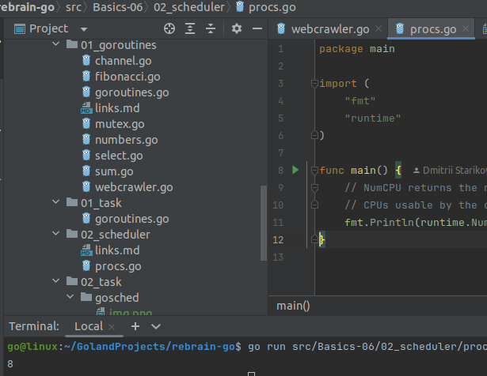
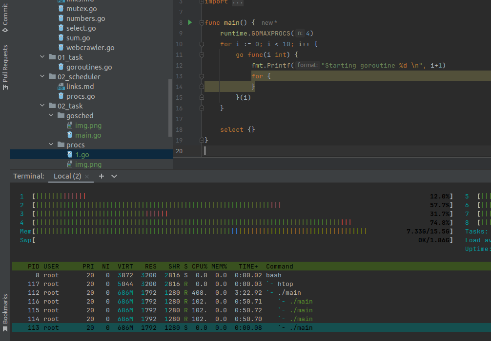
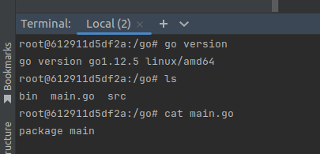
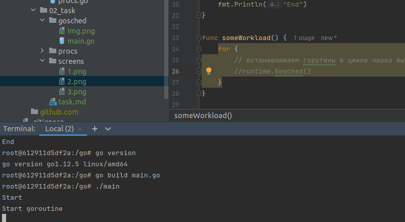
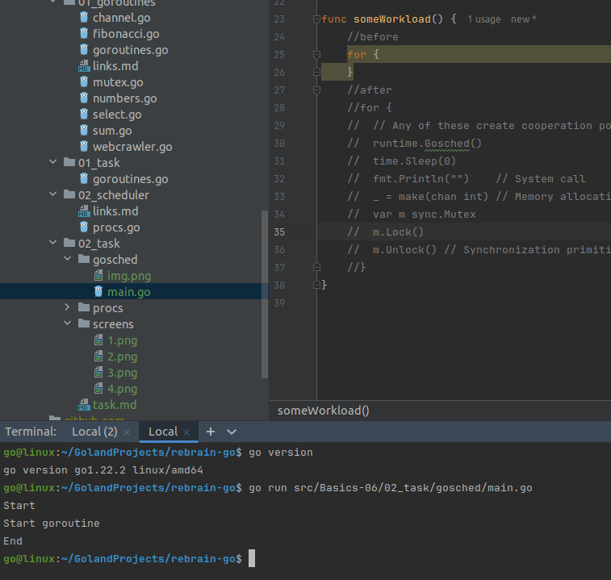
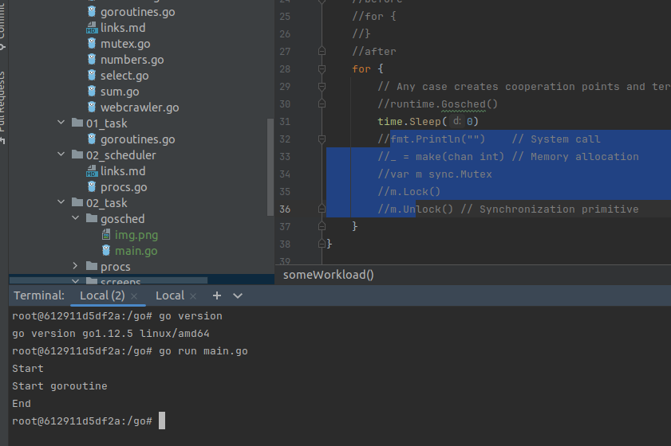

8 cores:



```bash
sudo usermod -aG docker $USER

cd src/Basics-06/02_task/

docker run -d -v `pwd`/procs/main.go:/go/main.go dhnikolas/golang-htop

docker exec -it 49b9c38f1f39 bash

root@49b9c38f1f39:/go# go version
go version go1.16.5 linux/amd64

go build main.go 

./main &
```

`procs/main.go` on 4 cores in 4 threads:



---
Make the program in gosched/main.go terminate completely when using Go 1.12, while only 
modifying the `someWorkload()` function. The challenge requires understanding at which
points the Go scheduler (in version 1.12) can perform goroutine switching.

```bash
docker run -d -v `pwd`/gosched/main.go:/go/main.go golang:1.12.5 tail -f /dev/null

docker exec -it 612911d5df2a bash
```

Go 1.12.5 in Docker container:



Run `gosched/main.go` with eternal for in container. The program does not finish.



## Go 1.12 Scheduler Behavior
In Go 1.12, the scheduler uses cooperative multitasking rather than preemptive 
multitasking. This means goroutines only yield control to other goroutines at 
specific "cooperation points."

### Without runtime.Gosched()
* The goroutine with the infinite loop (for {}) never voluntarily yields control
* The main goroutine is blocked on time.Sleep(1 * time.Second)
* The scheduler cannot switch goroutines because there are no cooperation points
* The program hangs indefinitely

### With runtime.Gosched()
* Each iteration of the loop calls runtime.Gosched()
* This explicitly tells the scheduler: "you can switch to another goroutine now"
* The main goroutine gets scheduled, executes time.Sleep, then prints "End"
* The program terminates successfully

### Key Points
Cooperation Points in Go 1.12
* The scheduler can switch goroutines only at specific points:
* Explicit yields: runtime.Gosched()
* System calls: File I/O, network operations, fmt.Println()
* Channel operations: Sending or receiving on channels
* Synchronization primitives: Mutex locks, WaitGroup waits
* Function calls (in some cases)

### Important Distinction: Go 1.12 vs Modern Go
Go 1.12 (cooperative): Requires explicit cooperation points
Modern Go (preemptive multitasking): Scheduler can interrupt long-running goroutines 
automatically

There are no freezing issues in Go 1.22.



### Summary
**Before (Go 1.12)**
- Goroutines run until they return control
- The scheduler cannot "snatch" control
- Risk: One "greedy" goroutine can block all others

**Now (Go 1.22)**
- The scheduler automatically terminates long-running goroutines
- Based on OS signals and timer interrupts
- More fair CPU time allocation

Testing the creation of cooperation points in Go 1.12

